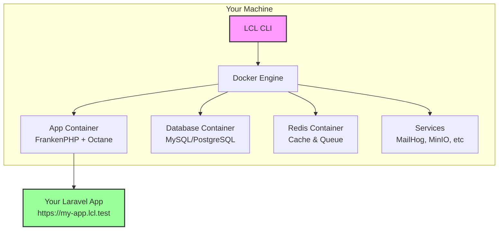

<div align="center">
  
  
  # Laravel Cloud Local (LCL)
  
  ### 🚀 Laravel Cloud on your machine in 60 seconds
  
  [](https://github.com/RianMorningstar/laravel-cloud-local-releases/releases)
  [](LICENSE)
  [](https://github.com/RianMorningstar/laravel-cloud-local-releases/releases)
  [](https://github.com/RianMorningstar/laravel-cloud-local-releases/stargazers)
  [](https://github.com/RianMorningstar/laravel-cloud-local-releases/wiki)
  
  **Zero-configuration local development environment that perfectly mirrors Laravel Cloud**
  
  [Documentation](https://github.com/RianMorningstar/laravel-cloud-local-releases/wiki) • 
  [Quick Start](#-quick-start) • 
  [Features](#-features) • 
  [Installation](#-installation) • 
  [Support](#-community--support)
  
</div>

---

## 📋 Table of Contents

- [✨ Features](#-features)
- [🚀 Quick Start](#-quick-start)
- [📦 Installation](#-installation)
- [📖 Documentation](#-documentation)
- [🎯 Commands](#-commands)
- [⚙️ Configuration](#️-configuration)
- [🏗️ Architecture](#️-architecture)
- [💬 Community & Support](#-community--support)
- [📝 License](#-license)

## ✨ Features

<table>
<tr>
<td width="50%">

### 🎯 Core Features
- **Zero Configuration** - Auto-detects Laravel requirements
- **Production Parity** - FrankenPHP with Octane support
- **Instant Setup** - Running in under 60 seconds
- **HTTPS by Default** - Automatic SSL certificates

</td>
<td width="50%">

### 🛠️ Developer Tools
- **Debugging** - Xdebug, Telescope, Horizon
- **Database GUI** - Adminer, Redis Commander
- **Email Testing** - MailHog for local mail capture
- **Preview Environments** - Branch-based previews

</td>
</tr>
<tr>
<td width="50%">

### 📊 Laravel Cloud Features
- **Deployment Simulation** - Test before deploying
- **Cost Estimation** - Predict Laravel Cloud costs
- **Auto-scaling Simulation** - Test scaling behavior
- **Zero-downtime Deploys** - Practice deployments

</td>
<td width="50%">

### 🔧 Service Stack
- **Databases** - MySQL 8.0, PostgreSQL 15
- **Cache/Queue** - Redis 7 with persistence
- **Storage** - MinIO (S3-compatible)
- **Workers** - Queue and scheduled tasks

</td>
</tr>
</table>

## 🚀 Quick Start

Get your Laravel application running in 3 simple steps:

```bash
# 1. Install Laravel Cloud Local
curl -fsSL https://raw.githubusercontent.com/RianMorningstar/laravel-cloud-local-releases/main/install.sh | bash

# 2. Navigate to your Laravel project
cd my-laravel-app

# 3. Start LCL
lcl up
```

Your app is now running at `https://my-app.lcl.test` 🎉

<details>
<summary><b>First time setup?</b> Click for detailed instructions</summary>

### Prerequisites
- Docker Desktop or Docker Engine (20.10+)
- Laravel 9.x or higher project

### Step-by-step Guide
1. **Install Docker Desktop** from [docker.com](https://www.docker.com/products/docker-desktop)
2. **Install LCL** using the installation script above
3. **Clone or create** a Laravel project
4. **Run `lcl up`** in the project directory
5. **Accept the SSL certificate** in your browser
6. **Start developing!**

</details>

## 📦 Installation

### 🔥 Quick Install (Recommended)

The fastest way to get started:

```bash
curl -fsSL https://raw.githubusercontent.com/RianMorningstar/laravel-cloud-local-releases/main/install.sh | bash
```

### Supported Platforms

<table>
<tr>
<th>Platform</th>
<th>Architecture</th>
<th>Download</th>
<th>Installation Method</th>
</tr>
<tr>
<td rowspan="2"></td>
<td>Intel (x64)</td>
<td><a href="https://github.com/RianMorningstar/laravel-cloud-local-releases/releases/latest/download/lcl-darwin-amd64">Download</a></td>
<td rowspan="2">

```bash
# Automatic
curl -fsSL https://raw.githubusercontent.com/RianMorningstar/laravel-cloud-local-releases/main/install.sh | bash

# Manual
wget <download-link>
chmod +x lcl-*
sudo mv lcl-* /usr/local/bin/lcl
```

</td>
</tr>
<tr>
<td>Apple Silicon (ARM64)</td>
<td><a href="https://github.com/RianMorningstar/laravel-cloud-local-releases/releases/latest/download/lcl-darwin-arm64">Download</a></td>
</tr>
<tr>
<td rowspan="2"></td>
<td>AMD64</td>
<td><a href="https://github.com/RianMorningstar/laravel-cloud-local-releases/releases/latest/download/lcl-linux-amd64">Download</a></td>
<td rowspan="2">

```bash
# Automatic
curl -fsSL https://raw.githubusercontent.com/RianMorningstar/laravel-cloud-local-releases/main/install.sh | bash

# Manual
wget <download-link>
chmod +x lcl-*
sudo mv lcl-* /usr/local/bin/lcl
```

</td>
</tr>
<tr>
<td>ARM64</td>
<td><a href="https://github.com/RianMorningstar/laravel-cloud-local-releases/releases/latest/download/lcl-linux-arm64">Download</a></td>
</tr>
<tr>
<td></td>
<td>AMD64</td>
<td><a href="https://github.com/RianMorningstar/laravel-cloud-local-releases/releases/latest/download/lcl-windows-amd64.exe">Download</a></td>
<td>

```bash
# WSL2 (required)
wsl --install

# Then in WSL2:
curl -fsSL https://raw.githubusercontent.com/RianMorningstar/laravel-cloud-local-releases/main/install.sh | bash
```

</td>
</tr>
</table>

### System Requirements

| Component | Minimum | Recommended |
|-----------|---------|-------------|
| **Docker** | 20.10+ | Latest stable |
| **Memory** | 4GB RAM | 8GB RAM |
| **Disk Space** | 2GB | 10GB |
| **CPU** | 2 cores | 4+ cores |
| **Laravel** | 9.x | 11.x |
| **PHP** | 8.0 | 8.2+ |

### Manual Installation

#### macOS / Linux

```bash
# 1. Download the appropriate binary from releases
wget https://github.com/RianMorningstar/laravel-cloud-local-releases/releases/latest/download/lcl-[platform]-[arch]

# 2. Make it executable
chmod +x lcl-*

# 3. Move to PATH
sudo mv lcl-* /usr/local/bin/lcl

# 4. Verify installation
lcl version
```

#### Windows

1. Install [WSL2](https://docs.microsoft.com/en-us/windows/wsl/install)
2. Install [Docker Desktop](https://www.docker.com/products/docker-desktop) with WSL2 backend
3. Open WSL2 terminal and follow Linux installation steps

### Package Managers

<details>
<summary><b>Coming Soon</b></summary>

#### Homebrew (macOS/Linux)
```bash
brew tap laravel/cloud-local
brew install lcl
```

#### APT (Debian/Ubuntu)
```bash
sudo add-apt-repository ppa:laravel/cloud-local
sudo apt update
sudo apt install lcl
```

#### YUM/DNF (RHEL/Fedora)
```bash
sudo dnf config-manager --add-repo https://packages.lcl.dev/rpm/lcl.repo
sudo dnf install lcl
```

#### Chocolatey (Windows)
```powershell
choco install laravel-cloud-local
```

</details>

## 📖 Documentation

Comprehensive documentation is available in our [GitHub Wiki](https://github.com/RianMorningstar/laravel-cloud-local-releases/wiki):

### 📚 Getting Started
- [Installation Guide](https://github.com/RianMorningstar/laravel-cloud-local-releases/wiki/Installation) - Platform-specific installation instructions
- [Quick Start Tutorial](https://github.com/RianMorningstar/laravel-cloud-local-releases/wiki/Quick-Start-Guide) - Get up and running in minutes
- [First Project](https://github.com/RianMorningstar/laravel-cloud-local-releases/wiki/First-Project) - Setting up your first Laravel project

### 📘 Core Documentation
- [Commands Reference](https://github.com/RianMorningstar/laravel-cloud-local-releases/wiki/Commands) - All LCL commands with examples
- [Configuration Guide](https://github.com/RianMorningstar/laravel-cloud-local-releases/wiki/Configuration) - Customize your environment
- [Services Documentation](https://github.com/RianMorningstar/laravel-cloud-local-releases/wiki/Services) - Database, Redis, Queue configuration

### 🔧 Advanced Topics
- [Preview Environments](https://github.com/RianMorningstar/laravel-cloud-local-releases/wiki/Preview-Environments) - Branch-based previews
- [Deployment Simulation](https://github.com/RianMorningstar/laravel-cloud-local-releases/wiki/Deployment-Simulation) - Test deployments locally
- [Performance Tuning](https://github.com/RianMorningstar/laravel-cloud-local-releases/wiki/Performance-Tuning) - Optimize your setup

### ❓ Help & Support
- [Troubleshooting Guide](https://github.com/RianMorningstar/laravel-cloud-local-releases/wiki/Troubleshooting) - Common issues and solutions
- [FAQ](https://github.com/RianMorningstar/laravel-cloud-local-releases/wiki/FAQ) - Frequently asked questions

## 🎯 Commands

### Essential Commands

| Command | Description | Example |
|---------|-------------|---------|
| `lcl up` | Start environment | `lcl up --telescope --horizon` |
| `lcl down` | Stop environment | `lcl down` |
| `lcl status` | Check service status | `lcl status` |
| `lcl logs` | View service logs | `lcl logs -f` |
| `lcl exec` | Execute commands in container | `lcl exec app bash` |

### Laravel Commands

| Command | Description | Example |
|---------|-------------|---------|
| `lcl artisan` | Run Artisan commands | `lcl artisan migrate` |
| `lcl tinker` | Start Tinker session | `lcl tinker` |
| `lcl db` | Database operations | `lcl db migrate --seed` |
| `lcl assets` | Asset management | `lcl assets dev` |

### Advanced Commands

| Command | Description | Example |
|---------|-------------|---------|
| `lcl preview` | Create preview environment | `lcl preview create feature-branch` |
| `lcl deploy` | Simulate deployment | `lcl deploy simulate --env production` |
| `lcl cost` | Estimate costs | `lcl cost estimate --detailed` |

[View Complete Commands Reference →](https://github.com/RianMorningstar/laravel-cloud-local-releases/wiki/Commands)

## ⚙️ Configuration

### Zero Configuration

LCL works out of the box by automatically detecting:

- ✅ PHP version from `composer.json`
- ✅ Laravel version from `composer.lock`
- ✅ Database type from `.env`
- ✅ Queue driver configuration
- ✅ Required PHP extensions
- ✅ Node.js version and package manager

### Custom Configuration (Optional)

Create `.lcl/config.yml` for customization:

```yaml
# .lcl/config.yml
version: '1.0'

php:
  version: '8.2'
  memory_limit: '512M'
  xdebug:
    enabled: true

database:
  type: mysql
  version: '8.0'

services:
  horizon: true
  telescope: true
  mailhog: true

resources:
  app:
    cpus: 4
    memory: '4G'
```

[View Configuration Guide →](https://github.com/RianMorningstar/laravel-cloud-local-releases/wiki/Configuration)

## 🏗️ Architecture



### Tech Stack

| Component | Technology | Purpose |
|-----------|------------|---------|
| **Runtime** | FrankenPHP | High-performance PHP runtime (same as Laravel Cloud) |
| **Web Server** | Caddy | Automatic HTTPS, reverse proxy |
| **PHP** | 8.0 - 8.3 | Multiple versions supported |
| **Database** | MySQL 8.0 / PostgreSQL 15 | Primary data storage |
| **Cache/Queue** | Redis 7 | Session, cache, and queue backend |
| **Storage** | MinIO | S3-compatible object storage |
| **Email** | MailHog | Local email testing |
| **Monitoring** | Telescope, Horizon | Application insights |

## 🔀 Comparison with Other Tools

<details>
<summary>How does LCL compare to other Laravel development tools?</summary>

| Feature | LCL | Sail | Valet | Homestead | Laradock |
|---------|-----|------|-------|-----------|----------|
| **Setup Time** | < 1 min | 5 mins | 10 mins | 30 mins | 15 mins |
| **Zero Config** | ✅ | ❌ | ⚠️ | ❌ | ❌ |
| **Laravel Cloud Parity** | ✅ | ❌ | ❌ | ❌ | ❌ |
| **Cross-Platform** | ✅ | ✅ | ❌ | ✅ | ✅ |
| **Resource Usage** | Low | Medium | Lowest | High | Medium |
| **Octane Support** | ✅ | ⚠️ | ❌ | ⚠️ | ⚠️ |
| **Preview Environments** | ✅ | ❌ | ❌ | ❌ | ❌ |
| **Cost Estimation** | ✅ | ❌ | ❌ | ❌ | ❌ |

</details>

## 🗺️ Roadmap

### Current Version: v1.0.0-alpha

- [x] Core functionality
- [x] Auto-detection system
- [x] FrankenPHP integration
- [x] Basic commands
- [x] Documentation

### Coming Soon (v1.1.0)

- [ ] GUI Dashboard
- [ ] Cloud synchronization
- [ ] Team collaboration features
- [ ] Plugin system
- [ ] Performance profiling
- [ ] Automated testing integration

### Future Plans

- [ ] Kubernetes support
- [ ] Multi-region simulation
- [ ] Load testing tools
- [ ] CI/CD integration
- [ ] VSCode extension

## 📊 Release Information

### Latest Release

Check the [Releases page](https://github.com/RianMorningstar/laravel-cloud-local-releases/releases) for the latest version.

### Version History

| Version | Date | Highlights |
|---------|------|------------|
| v1.0.0-alpha | 2024-01-01 | Initial alpha release |
| v0.9.0 | 2023-12-01 | Beta with core features |
| v0.5.0 | 2023-11-01 | Preview release |

### Download Statistics


## 💬 Community & Support

<table>
<tr>
<td align="center">
  <a href="https://github.com/RianMorningstar/laravel-cloud-local-releases/issues">
    
    <br>Report Issues
  </a>
</td>
<td align="center">
  <a href="https://stackoverflow.com/questions/tagged/laravel-cloud-local">
    
    <br>Stack Overflow
  </a>
</td>
<td align="center">
  <a href="https://github.com/RianMorningstar/laravel-cloud-local-releases/wiki">
    
    <br>Documentation
  </a>
</td>
</tr>
</table>

### Getting Help

1. **Check Documentation**: Browse our [comprehensive wiki](https://github.com/RianMorningstar/laravel-cloud-local-releases/wiki)
2. **Search Issues**: Look for [existing issues](https://github.com/RianMorningstar/laravel-cloud-local-releases/issues)
3. **Report Bugs**: [Create an issue](https://github.com/RianMorningstar/laravel-cloud-local-releases/issues/new)

## 🤝 Contributing

While this repository contains only the binary releases, we welcome contributions to the main project:

- **Source Code**: [laravel-cloud-local](https://github.com/RianMorningstar/laravel-cloud-local)
- **Report Bugs**: [Create an issue](https://github.com/RianMorningstar/laravel-cloud-local-releases/issues/new)
- **Documentation**: [Edit the wiki](https://github.com/RianMorningstar/laravel-cloud-local-releases/wiki)
- **Feature Requests**: [Create an issue](https://github.com/RianMorningstar/laravel-cloud-local-releases/issues/new)

## 🛡️ Security

### Reporting Security Issues

Please report security vulnerabilities to security@lcl.dev. Do not create public issues for security problems.

### Checksums

All releases include SHA256 checksums for verification:

```bash
# Download checksum file
wget https://github.com/RianMorningstar/laravel-cloud-local-releases/releases/latest/download/checksums.txt

# Verify your download
sha256sum -c checksums.txt
```

## 📝 License

Laravel Cloud Local is open-source software licensed under the [MIT License](LICENSE).

```
MIT License

Copyright (c) 2024 Laravel Cloud Local Contributors

Permission is hereby granted, free of charge, to any person obtaining a copy
of this software and associated documentation files (the "Software"), to deal
in the Software without restriction...
```

[View Full License →](LICENSE)

## 🙏 Acknowledgments

- **Laravel Team** - For creating an amazing framework
- **FrankenPHP** - For the high-performance PHP runtime
- **Docker** - For containerization technology
- **Community Contributors** - For feedback and contributions
- **You** - For using and supporting LCL!

## ⚠️ Disclaimer

> Laravel Cloud Local is a community project and is not officially affiliated with Laravel, Laravel Cloud, or Taylor Otwell. This project is designed to complement Laravel Cloud by providing a compatible local development environment.

---

<div align="center">
  <b>Built with ❤️ for the Laravel Community</b>
  <br><br>
  <a href="https://github.com/RianMorningstar/laravel-cloud-local-releases/wiki">📖 Documentation</a> •
  <a href="https://github.com/RianMorningstar/laravel-cloud-local-releases/releases">📦 Downloads</a> •
  <a href="https://github.com/RianMorningstar/laravel-cloud-local-releases/issues">🐛 Report Bug</a> •
  <a href="https://github.com/RianMorningstar/laravel-cloud-local-releases/issues/new">💡 Request Feature</a>
  <br><br>
  
  
  
</div>